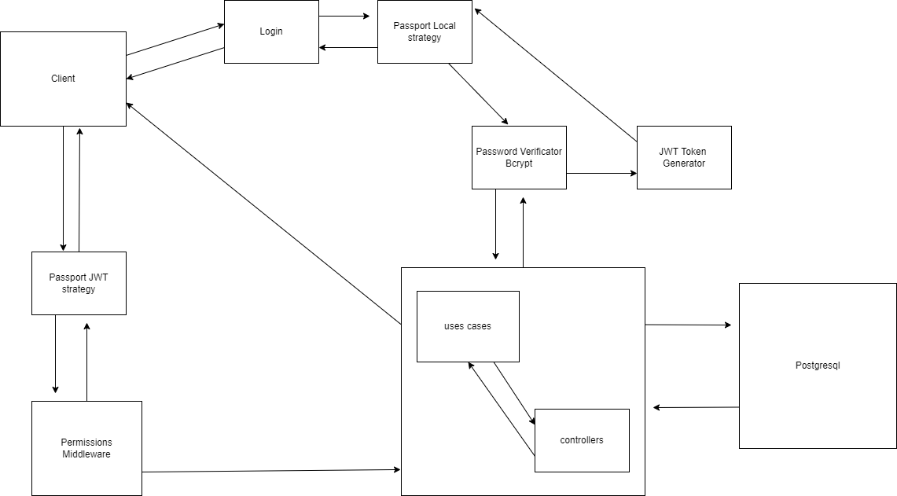

# NodeBack
## Node backend for DashBoard project
![typescript-badge][typescript-badge] ![node-badge][node-badge] ![express-badge][express-badge] ![postgresql-badge][postgresql-badge]

Frontend Example in: 
https://www.rafacli.site/dashboard

Backend Docs in: 
https://nodeback-production-3eb4.up.railway.app/doc

Users to test: 
- Admin
    username: admin@w.com
    password: adminPassword1234*
- User
    username: user1@w.com
    password: secureUser123

### Tech implemented:
- Node.js
- Express.js
- Typescript
- Sequelize
- Postgresql
- Cors
- express-rate-limiter
- Clean Architecture
- Passport
- JWT

## License
MIT

[typescript-badge]: https://badgen.net/badge/icon/typescript?icon=typescript&label
[express-badge]: https://badgen.net/badge/icon/express/black?icon=express&label
[node-badge]: https://badgen.net/badge/icon/node.js/green?icon=node&label
[postgresql-badge]: https://badgen.net/badge/icon/postgresql/blue?icon=postgresql&label